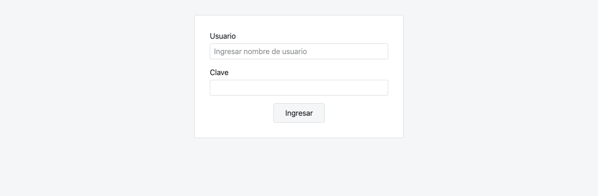
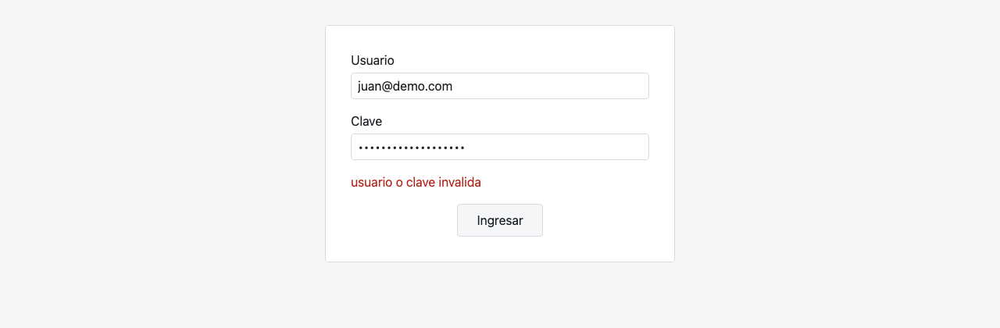
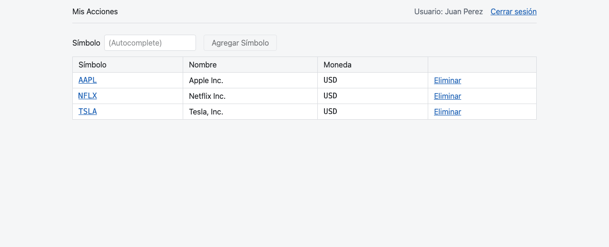
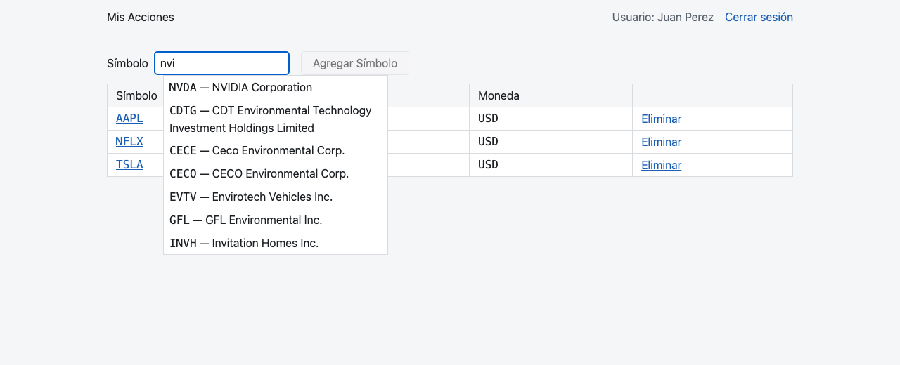
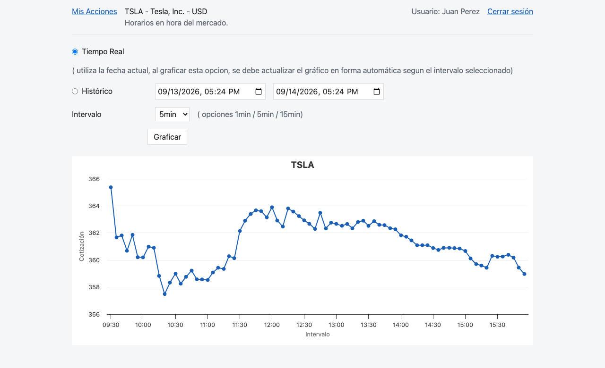
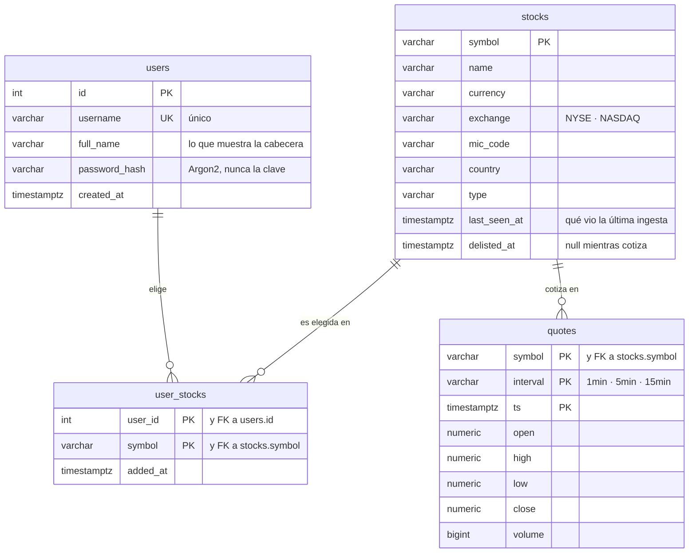
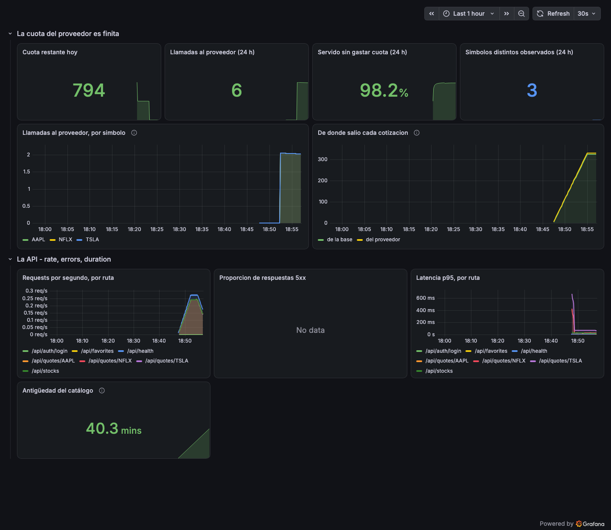
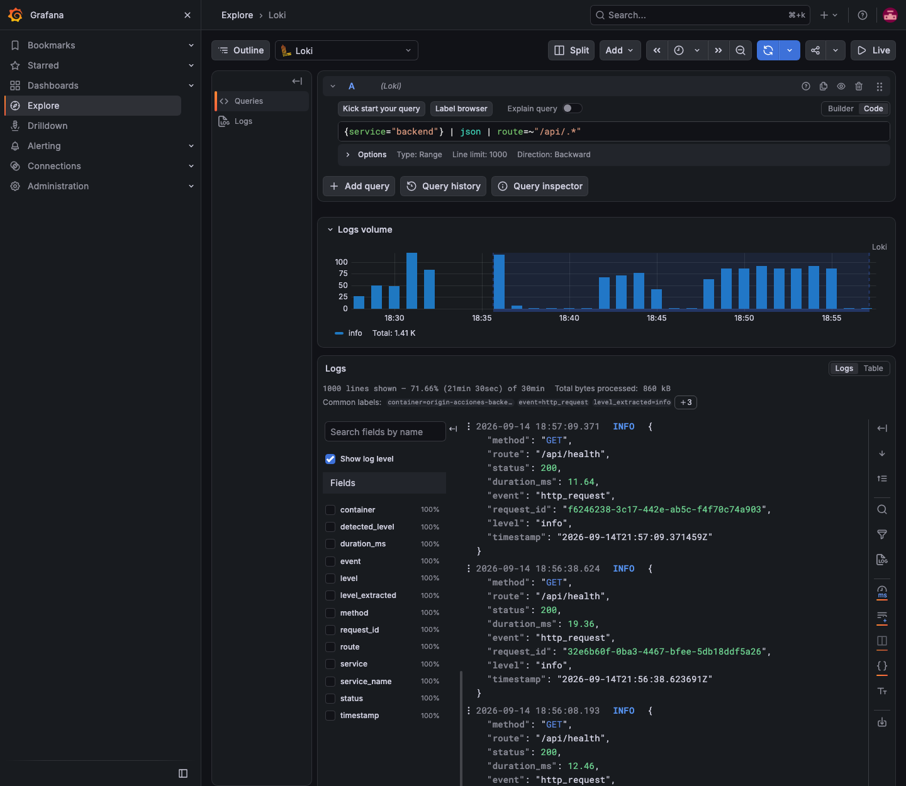
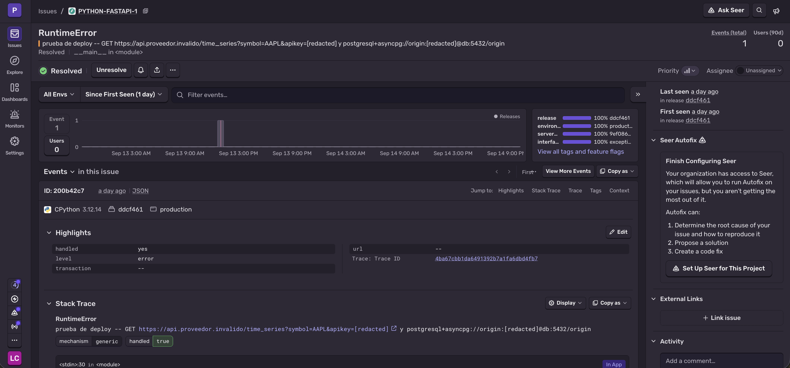

# ORIGIN Acciones

[](https://github.com/leandrocarriego/origin_solutions_challenge/actions/workflows/ci.yml)

Aplicación web para seguir la cotización de acciones en tiempo real, resuelta sobre el enunciado
*Challenge Acciones* de Origin Solutions. Los datos vienen de la API pública de
[TwelveData](https://twelvedata.com/).

**Backend** en Python + FastAPI sobre PostgreSQL. **Frontend** en React 19 + TypeScript. Los dos
detrás de un `docker compose` que levanta el proyecto entero con un comando.

**En producción: https://origin-solutions-challenge.leandrocarriego.com** — con el proveedor real,
sin instalar nada.

## Las tres pantallas

| Login | Credenciales inválidas |
|---|---|
|  |  |

| Mis Acciones | El autocomplete, sobre el catálogo real |
|---|---|
|  |  |



## Puesta en marcha

Necesitás **Docker** y nada más.

```bash
git clone git@github.com:leandrocarriego/origin_solutions_challenge.git
cd origin_solutions_challenge
make setup
```

`make setup` deja todo funcionando desde cero: crea el `.env`, pregunta dos credenciales
—**las dos opcionales**—, construye las imágenes, aplica las migraciones, carga los datos de
prueba, espera a que la API esté sana y te dice dónde entrar.

| | |
|---|---|
| **Aplicación** | http://localhost:5173 |
| **Usuario** | `juan@demo.com` · `Demo1234*` |
| API | http://localhost:8000/api/health |
| OpenAPI | http://localhost:8000/docs |
| Grafana | http://localhost:3000 — `juan@demo.com` · `Demo1234*` |

Después del setup: `make up` levanta, `make down` baja conservando la base, `make logs` sigue los
logs.

> **Sobre la API key.** Si la omitís, la aplicación funciona igual: el proveedor de datos pasa a ser
> uno simulado y el catálogo se restaura del backup, con los **7.155 símbolos** de NYSE y NASDAQ.
> Es la misma aplicación, el mismo código y la misma interfaz — sólo cambia la implementación que
> hay detrás (`ADR-006`). Con una key real, las cotizaciones son reales.
>
> Que la aplicación arranque sin credenciales no es una comodidad: es el Artículo VI, que exige que
> **la suite completa corra sin red y sin API key**. El mismo mecanismo que hace testeable el
> proyecto es el que te deja evaluarlo sin abrir una cuenta.

### Para ver que funciona en cinco minutos

1. Entrá con `juan@demo.com` / `Demo1234*`. La cabecera dice `Usuario: Juan Perez` — el **nombre**,
   no el usuario con el que ingresaste.
2. Probá una clave equivocada primero: sale `usuario o clave invalida`, literal.
3. En *Mis Acciones* hay tres favoritas sembradas: TSLA, AAPL y NFLX, las tres del wireframe.
4. Escribí `nvi` en el autocomplete: aparece **NVDA — NVIDIA Corporation**. La búsqueda es sobre la
   base, no sobre la API del proveedor.
5. Agregá NVDA, borrá NFLX con *Eliminar*: la grilla se refresca sola.
6. Click en `TSLA` → detalle. Elegí intervalo `5min` y *Graficar*.
7. Volvé a *Graficar* varias veces: ninguna de esas veces sale una llamada al proveedor. El dato ya
   está en la base, y eso se ve en el dashboard de Grafana.
8. Entrá también con `ana@demo.com` / `Demo1234*`: sus favoritas son otras, y no hay forma de
   llegar a las de Juan.

## Despliegue

```bash
make deploy
```

Sincroniza el árbol, construye, espera a que el backend esté sano y limpia **sólo** las imágenes de
este proyecto. El VPS está compartido con otros proyectos en producción, y de ahí salen las reglas
del `docker-compose.prod.yml`: ningún contenedor publica un puerto en una interfaz pública, todos
tienen límite de memoria, y el nombre del proyecto es distinto para que compose nunca toque
contenedores ajenos.

El enunciado no pedía desplegar. Está desplegado igual, porque una aplicación que corre en el VPS de
otro es la única forma de mostrar que anda sin pedirte que la instales:
**https://origin-solutions-challenge.leandrocarriego.com**

## Modelo de datos

Cuatro tablas. Una migración de Alembic las crea, y el entrypoint corre `alembic upgrade head` en
todos los entornos: el esquema nunca queda atrás del código.



Cuatro decisiones que vale la pena mirar:

- **La clave primaria de `user_stocks` es `(user_id, symbol)`.** Por eso el alta es idempotente sin
  una sola línea de lógica: agregar dos veces la misma acción no puede duplicar una fila, lo impide
  la base. Un test lo fija (`TEST-04`).
- **La clave primaria de `quotes` es `(symbol, interval, ts)`.** Es la caché del Artículo II: la
  misma vela, pedida por diez usuarios, se escribe una vez. La reingesta de un tramo ya conocido no
  duplica nada, hace `upsert`.
- **El catálogo tiene `last_seen_at` y `delisted_at`, no un booleano.** La respuesta del proveedor
  es una foto de lo que cotiza hoy y no trae ningún campo de estado: la baja se **deduce** de no
  aparecer en la última foto (`ADR-002`).
- **`symbol` es la clave primaria de `stocks`** y la referencian las otras dos tablas. El símbolo es
  el identificador natural del dominio; un `id` sintético al lado habría sido una columna que nadie
  usa.

El enunciado pide un backup: está en [`db/backup.sql`](db/backup.sql), generado desde la base ya
sembrada con `make backup` y restaurable con `make restore`. No está escrito a mano: `seed.py` es la
fuente de los datos de prueba, y el backup es la fotografía de lo que produjo.

## Seguridad

| Qué | Cómo |
|---|---|
| Las passwords | **Argon2**, nunca en texto plano y nunca en un log. La verificación es de tiempo constante y no distingue "usuario que no existe" de "clave equivocada" |
| La sesión | JWT firmado, con un secreto que **no tiene default en producción**: el proceso no arranca sin él, en vez de firmar con algo adivinable |
| La API key del proveedor | **Nunca sale del backend**. No va en una variable `VITE_*`, ni en una respuesta, ni en un log, ni en un traceback (Artículo I) |
| Los datos de cada usuario | Toda lectura y escritura filtra por el `sub` del token y **nunca** por un id que venga del path, del query o del body (Artículo III) |
| Fuerza bruta en el login | Límite de intentos por usuario y por dirección, que no se puede esquivar falsificando `X-Forwarded-For` |
| Lo que sale hacia Sentry | Un `before_send` que enmascara secretos por valor y por forma, y las tres opciones que filtrarían credenciales apagadas |

Las dos que más importan tienen test propio, y no de los que se leen: se rompen solas si alguien las
viola.

**El aislamiento por usuario es API1:2023 — BOLA**, el número uno de la OWASP API Security Top 10 y
el más fácil de introducir sin darse cuenta. Que el frontend "siempre mande el propio id" no es un
control: el frontend es del atacante. El repositorio recibe el usuario autenticado y **no tiene
forma de recibir otro** — `backend/tests/integration/test_user_isolation.py` lo verifica, y hay un
test de arquitectura que falla si una query de datos de usuario confía en un id del request.

**La API key no es alcanzable desde el navegador** porque el frontend no conoce el dominio del
proveedor: le pide a nuestra API. Un test de arquitectura prohíbe que cualquier archivo fuera de
`app/providers/` importe un cliente HTTP, así que "armar la URL a mano" no compila.

## Estructura del código

Dos proyectos, como pide el enunciado, y un tercero que es la infraestructura:

```
backend/     Python · FastAPI · SQLAlchemy 2 · Alembic · uv
frontend/    TypeScript · React 19 · Vite · Tailwind · npm
infra/       Prometheus, Loki, Alloy y Grafana, con los SLOs como código
load/        la prueba de carga (k6)
db/          el backup de la base
docs/        brief, decisiones, specs, diseño y capturas
agents/      los roles y las skills del proceso de desarrollo
```

El backend es un **monolito modular por dominios** — `auth`, `stocks`, `favorites`, `quotes` — y
cada módulo es dueño de su router, sus schemas, su lógica, su acceso a datos y sus tablas:

```
app/modules/quotes/
  __init__.py     el contrato: un __all__ y nada más
  router.py       HTTP
  schemas.py      los modelos Pydantic
  service.py      las decisiones del negocio
  repository.py   el acceso a datos
  models.py       SQLAlchemy
```

Tres fronteras, y **las tres las verifica un test que rompe el build**:

1. **Un módulo nunca importa el interior de otro.** El contrato es el paquete: lo que declara
   `__all__`, con tipos propios y nunca un modelo del ORM. Un contrato que devuelve el ORM no aisló
   nada.
2. **Adentro del módulo el flujo va en un solo sentido**: `router → service → repository`. Un router
   no importa SQLAlchemy; un service no importa FastAPI y comunica fallas con excepciones de
   dominio que el router traduce a HTTP.
3. **Todo proveedor externo vive detrás de su interfaz.** El nombre `twelvedata` aparece en un solo
   archivo de todo el repositorio.

Python no tiene visibilidad a nivel de módulo: el guión bajo y `__all__` son convención, no
enforcement. Por eso la frontera **no** se sostiene con disciplina ni con code review — la sostiene
`backend/tests/architecture/`, y un import que la cruza no llega a `main`.

El detalle está en [`ARCHITECTURE.md`](ARCHITECTURE.md).

## Frente a los NFR

> *"No se evaluará el diseño ni el conocimiento sobre UI, sino la funcionalidad y la estabilidad de
> la solución, el modelo de datos, la atención a los requerimientos, seguridad, estructura del
> código y la actitud frente a los NFR: mantenibilidad, extensibilidad y escalabilidad."*

Esta sección es esa actitud. Cada táctica va con el archivo que la verifica, porque un NFR afirmado
en prosa no vale nada.

### Mantenibilidad

| Táctica | Evidencia |
|---|---|
| Monolito modular por dominios, cada uno dueño de sus tablas | `ARCHITECTURE.md` |
| Ningún módulo importa el interior de otro | `tests/architecture/` — **rompe el build** |
| Flujo en un solo sentido adentro del módulo, y sin ciclos | `tests/architecture/` |
| Tipos completos: `mypy --strict` y `tsc --noEmit` | `make typecheck` |
| Los tipos del frontend se **generan** del OpenAPI: un cambio de contrato rompe la compilación del front, no la demo | `make types` |
| Convenciones con identificador estable, severidad y comando que las verifica | [`CONVENTIONS.md`](CONVENTIONS.md) |
| Errores de dominio como excepciones, con un único traductor a HTTP | `app/error_handlers.py` |
| Logs correlacionados, métricas, dashboard y reporte de errores | `ADR-009` |

### Extensibilidad

| Táctica | Evidencia |
|---|---|
| El proveedor detrás de una clase abstracta, devolviendo tipos propios | `app/providers/base.py` |
| Ningún archivo fuera de `providers/` puede importar un cliente HTTP | `tests/architecture/` — **rompe el build** |
| Hay un **segundo proveedor real y en uso** (`FakeProvider`): la sustitución no es teórica, está ejercitada en cada corrida de la suite | `TEST-03` |
| Cambiar de proveedor es escribir una clase y cambiar una variable de entorno. Ningún service, router ni test de negocio se toca | `make setup` lo hace en vivo |
| Cada archivo del módulo crece a carpeta del mismo nombre, sin mover nada de lugar | `AGENTS.md` |
| Migraciones versionadas; el esquema nunca queda atrás del código | `alembic upgrade head` en el entrypoint |

### Escalabilidad

Este es el problema de ingeniería central del challenge, y conviene verlo con números. El plan
gratuito da **800 requests por día**. Un solo usuario con un gráfico en tiempo real a intervalo de
1min consume **480 requests en una rueda de 8 horas**. Dos usuarios y la cuota se agotó: la
implementación ingenua —el navegador pide, el backend reenvía— no sobrevive a la demo.

| Táctica | Evidencia |
|---|---|
| **El consumo escala con símbolos distintos observados, no con clientes conectados**: diez usuarios mirando TSLA cuestan lo mismo que uno | `ADR-003` |
| El frontend nunca llama al proveedor: pide a nuestra API, que resuelve contra la tabla `quotes` y sólo sale cuando el tramo tiene un hueco **y** el dato venció (TTL = duración del intervalo) | `tests/unit/test_quotes_service.py` |
| El catálogo se ingesta y se reconcilia; el autocomplete consulta la base. Proxear cada tecla tipeada agotaría los 800 requests en minutos | `ADR-002` |
| El polling se corta cuando la pestaña deja de estar visible: una pestaña olvidada no renueva el TTL toda la rueda | `ADR-003` |
| El techo está **calculado y escrito**, no descubierto en la demo: a `15min`, 24 símbolos simultáneos; a `1min`, uno | tabla de `ADR-003` |
| Backend sin estado en memoria — la caché vive en Postgres — e I/O asíncrono de punta a punta | — |
| Y el consumo se **grafica**: es un número, no una afirmación de un documento | el dashboard, más abajo |

Todo eso sigue siendo el sistema hablando de sí mismo. Por eso hay una **prueba de carga** que lo
somete a concurrencia real y después mide qué costó:

```bash
make load
```

Cincuenta usuarios virtuales pidiendo **el mismo símbolo** durante 85 segundos. El resultado de la
última corrida:

```
3.611 requests · p95 = 23,67 ms · 0 errores
llamadas al proveedor durante la corrida: 1
```

**Tres mil seiscientos once pedidos concurrentes costaron un crédito.** Y no es una observación al
margen: el script lee `provider_requests_total` de `/metrics` antes y después, y **falla si el
contador se movió más de uno**. O sea que es el Artículo II convertido en un test que rompe el
build, no en un párrafo.

## Cómo se desarrolló esto

El proyecto se dirige por **Spec-Driven Development**, con un proceso **propio**: los roles, las
skills, los doce comandos y la constitución están escritos para este repositorio, inspirados en
GitHub Spec Kit pero sin instalarlo ni depender de él.

La cadena es `spec → plan → tasks → tests → implementación → convergencia → review`, con **tres
puertas donde firma un humano**: la spec antes de que exista un plan, **los tests antes de que
exista la implementación**, y el review de calidad antes del merge.

Pero SDD solo no alcanzaba, así que el enfoque es híbrido y toma de otros dos lo que cada uno
resuelve mejor:

- **TDD**, para el paso que va del plan al código. Los tests de cada historia se escriben contra
  módulos, endpoints y firmas que **todavía no existen** —por eso el `plan.md` es load-bearing acá:
  si no alcanza para escribir el test, se vuelve a planificar en vez de inventar la firma— y recién
  cuando el humano los firma se escribe la implementación que los pone en verde. SDD aporta *qué*
  hay que construir; TDD, *cuándo* está terminado.

- **DDD**, para trazar las fronteras. Los cuatro módulos —`auth`, `stocks`, `favorites`, `quotes`—
  no son capas técnicas ni carpetas por tipo de archivo: son **capacidades del negocio con lenguaje
  propio**, cada una dueña de sus tablas y con un contrato explícito hacia afuera. De ahí salen el
  criterio para abrir un módulo nuevo (aparece una capacidad con vocabulario propio, no un archivo
  que creció), la regla de que el proveedor externo vive detrás de una interfaz que habla el idioma
  del dominio y no el del vendor, y la de que un contrato **nunca** devuelve un modelo del ORM.

De DDD se toma el corte por dominios y el contrato entre ellos; no la maquinaria completa —no hay
agregados, eventos de dominio ni event sourcing—, porque el enunciado no tiene la complejidad que
justificaría ese costo. Usar el patrón donde no hace falta es la otra forma de equivocarse.

Que los tests vayan antes no es una preferencia de estilo. Un test escrito después describe lo que
el código hace; escrito antes, describe lo que tiene que hacer. La diferencia es **quién define
"terminado"**: el agente que ya resolvió algo, o la persona que pidió el resultado. En un proceso
donde la mayor parte del trabajo la hacen agentes, la firma sobre los tests es el único punto donde
el contrato se fija en términos ejecutables y no en prosa.

| Documento | Qué contiene |
|---|---|
| [`CONSTITUTION.md`](CONSTITUTION.md) | Los diez principios no negociables. Autoridad número uno |
| [`AGENTS.md`](AGENTS.md) | Punto de entrada: roles, fronteras, flujo de git, Definition of Done |
| [`ARCHITECTURE.md`](ARCHITECTURE.md) | La estructura del repositorio y el recorrido de una cotización |
| [`CONVENTIONS.md`](CONVENTIONS.md) | Cada convención con su identificador, su severidad y el comando que la verifica |
| [`docs/PROJECT_BRIEF.md`](docs/PROJECT_BRIEF.md) | El enunciado traducido a alcance verificable, con sus ambigüedades declaradas |
| [`docs/DECISIONS.md`](docs/DECISIONS.md) | Las nueve decisiones técnicas transversales (ADR) |
| [`docs/specs/archive/`](docs/specs/archive/) | Una carpeta por feature: spec, plan, tasks y las firmas |

## Tests

```bash
make test        # suite completa con cobertura
make check       # lint + tipos + tests, en el orden en que conviene fallar
```

**596 tests en el backend** (94% de cobertura) y **283 en el frontend**. La suite completa corre
**sin red y sin API key**: el proveedor se testea contra JSON fijado, nunca contra la API en vivo.
Una suite que sale a la red consume la cuota del Artículo II — y además no es una suite, es un
monitoreo.

Cuatro tipos de test, y el tercero es el que sostiene todo lo demás:

| Tipo | Qué fija |
|---|---|
| Unitarios | La lógica pura: detección de huecos, TTL, búsqueda, estados de falla |
| Integración | Endpoints y base de datos de verdad, con Postgres |
| **Arquitectura** | Las fronteras entre módulos, las capas, el aislamiento por usuario, el proveedor detrás de su interfaz. **Rompen el build** |
| Frontend | Las pantallas contra `COPY.md`, el refresco automático, los avisos de estado |
| **Carga** (k6) | Que la cuota no la gasta la concurrencia, y que los SLOs se cumplen bajo presión — `make load`, [`load/quotes.js`](load/quotes.js) |

La de carga corre aparte de `make check` porque necesita la aplicación levantada, y sus umbrales
son los mismos tres SLOs de más abajo: si uno se viola, k6 termina con código distinto de cero.
Los resultados se escriben además a Prometheus (`remote write`), así que la corrida y lo que la
corrida costó quedan en el mismo eje de tiempo, en Grafana, al lado de las métricas de la
aplicación.

Cada push corre el workflow `CI`: lint, tipos y suite del backend contra un Postgres real; lo mismo
del frontend; `pre-commit` sobre todo el árbol; y el build de las imágenes Docker.

## Atención a los requerimientos

El enunciado está traducido a **25 requisitos atómicos y verificables** en
[`docs/PROJECT_BRIEF.md`](docs/PROJECT_BRIEF.md), con una tabla de trazabilidad que asocia cada uno
al test que lo cubre. No hay `REQ-NN` sin test.

Y donde el enunciado deja algo abierto, la decisión se escribe en vez de tomarse en silencio dentro
del código. Las siete están en el brief, con su alternativa descartada; las tres que más cambian el
resultado:

- **"Tiempo real" contra un plan gratuito que no tiene streaming.** Se interpreta como lo define el
  propio enunciado —*"graficar la cotización en base a la fecha del día"* con refresco automático
  según el intervalo—: es polling, y el polling es del frontend **contra nuestra API**, no contra
  TwelveData. *Descartado:* un WebSocket propio sobre un upstream que no lo provee, que sería
  complejidad sin un dato nuevo detrás.
- **El enunciado se contradice con su propio wireframe.** Sugiere `exchange=NYSE` para llenar el
  autocomplete, pero los tres símbolos de su grilla de ejemplo —TSLA, AAPL, NFLX— cotizan en
  **NASDAQ**: siguiéndolo al pie no se puede reproducir su propia pantalla. Se ingestan los dos
  mercados.
- **Qué mostrar fuera del horario de mercado.** Un gráfico vacío un domingo parece un bug: se
  grafica la última rueda disponible **con un aviso explícito arriba del gráfico**.

Lo que el enunciado no pide, no se construyó. Eso también está declarado, en *Fuera de alcance*.

## Observabilidad

Cuatro capas, decididas en [`ADR-009`](docs/DECISIONS.md).



El dashboard existe por el **Artículo II**: que el consumo escale con símbolos observados y no con
clientes conectados es una propiedad de la arquitectura, y sin contadores sería una afirmación en un
documento. Los paneles miden cuánta cuota queda, cuántas llamadas salieron de verdad, **qué
proporción se sirvió sin gastar cuota** y cuántos símbolos distintos se observaron.



Los logs son JSON, una línea por evento, con un `request_id` que atraviesa todas las líneas de un
mismo pedido y vuelve en la respuesta. Un `X-Request-ID` entrante se respeta en vez de reemplazarse,
así la cadena sobrevive al proxy. Se agregan en **Loki**, que Grafana consulta como datasource.



Y los errores van a **Sentry**. Mirá la captura con atención: el evento lleva la URL del proveedor y
la cadena de conexión de Postgres, y las dos llegan como `apikey=[redacted]` y
`postgresql+asyncpg://origin:[redacted]@db:5432/origin`. Sentry captura las variables locales de
cada frame por defecto, y en este backend esos frames tienen las dos credenciales: sin el scrubber,
un solo 500 se las manda a un tercero.

### Los SLOs

Medir sin un objetivo es mirar números. Los tres objetivos del servicio están declarados como
código en [`infra/grafana/provisioning/alerting/slos.yml`](infra/grafana/provisioning/alerting/slos.yml),
se provisionan solos con Grafana y son los mismos umbrales que `make load` asserta:

| SLO | Indicador | Objetivo |
|---|---|---|
| Latencia del gráfico | p95 de `/api/quotes` sobre 30 min | **< 300 ms** |
| Salud de la API | proporción de respuestas 5xx | **< 1%** |
| **Cuota del proveedor** | `provider_quota_remaining` | **> 100** créditos de los 800 |

El tercero es el que no sale de ningún manual: mide lo que **este** sistema puede quedarse sin. Un
servicio puede estar al 100% de disponibilidad y ser inútil a las 16:00 porque la cuota se agotó al
mediodía — sigue respondiendo con lo que tiene en la base, pero deja de incorporar cotizaciones
nuevas. Es una forma de estar caído que ningún health check ve, y por eso es un SLO y no una
curiosidad del dashboard.

**No hay SLA, y es a propósito.** Un SLA es un contrato con un cliente, con plata atrás si se
incumple. Acá no hay cliente pagando: escribir uno sería inventar un acuerdo que nadie firmó. El
SLO es el objetivo interno, y se pone siempre más exigente que el SLA que lo acompañaría, para
enterarse antes de romper el contrato y no después.

## Comandos

`make help` los lista todos.

| Comando | Qué hace |
|---|---|
| `make setup` | De cero a funcionando: credenciales, contenedores, migraciones y datos |
| `make up` · `make down` · `make logs` | Levantar, bajar y seguir los logs |
| `make backup` · `make restore` | El backup de la base, y su restauración |
| `make check` | Lint, tipos y la suite completa de los dos proyectos |
| `make test` · `make test-fast` | Suite con cobertura · sólo unidad y arquitectura |
| `make load` | Prueba de carga con k6: 50 usuarios sobre el mismo símbolo |
| `make types` | Regenera los tipos del frontend desde el OpenAPI del backend |
| `make deploy` | Despliega al VPS |

### Para desarrollar sin Docker

Backend con [uv](https://docs.astral.sh/uv/), frontend con npm. **Sin excepciones**: es el
Artículo IX, y lo que compra es que el build sea reproducible.

```bash
make install      # uv sync --frozen  +  npm ci, los dos desde su lockfile
make hooks        # los hooks de pre-commit y commit-msg
make dev-backend  # http://localhost:8000
make dev-frontend # http://localhost:5173
```

## Variables de entorno

Todas viven en `.env`, que **no se versiona**. `.env.example` es la plantilla con el porqué de cada
una al lado, y `make setup` se encarga de las dos que hacen falta en local.

| Variable | Para qué | Si está vacía |
|---|---|---|
| `TWELVEDATA_API_KEY` | La credencial del proveedor | Se usa el proveedor simulado y el catálogo del backup |
| `SENTRY_DSN` | Reporte de errores | Sentry desactivado: sin eventos y sin red |
| `JWT_SECRET` | Firma de la sesión | En local hay uno de desarrollo; en producción el proceso no arranca |
| `POSTGRES_PASSWORD` | Credencial de la base | Sólo producción: el compose se niega a arrancar |
| `GRAFANA_ADMIN_PASSWORD` | Login de Grafana | Sólo producción: el compose se niega a arrancar |
| `DOMAIN` | Host que enruta Traefik | Sólo producción |
